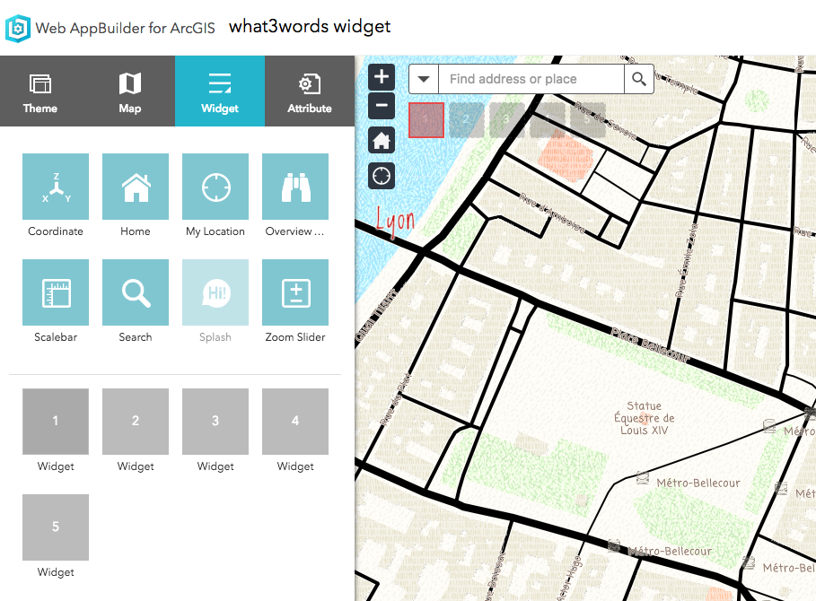
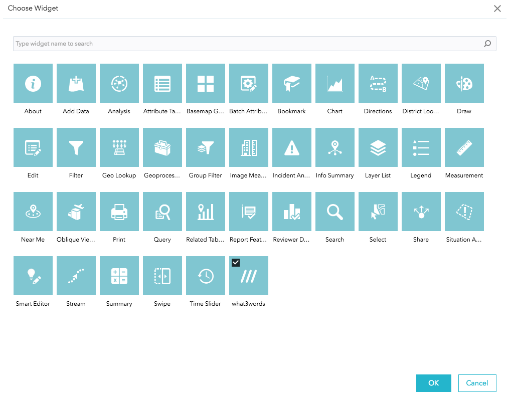
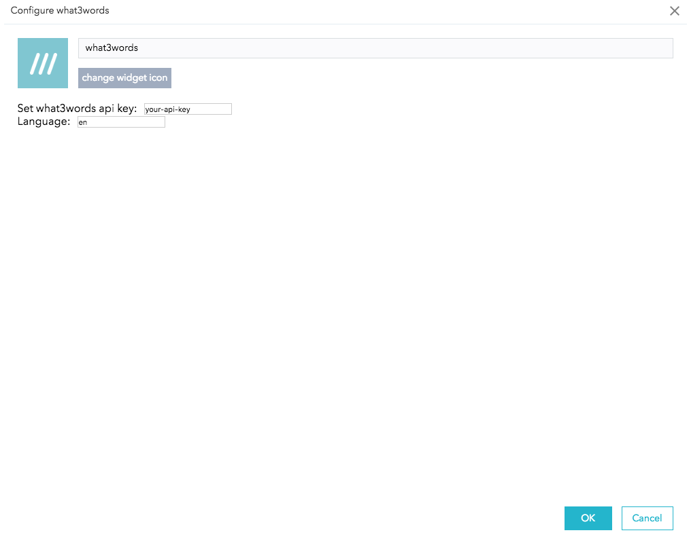
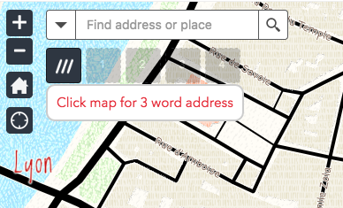

# <image src="https://what3words.com/assets/images/w3w_square_red.png" width="32" height="32">&nbsp;w3w-arcgis-webappbuilder-widget

A custom widget for [Web AppBuilder for ArcGIS](https://developers.arcgis.com/web-appbuilder/) providing reverse geocoding via the [what3words API](https://docs.what3words.com/api/v2/).

## Prerequisites

- An installed and configured instance of [Web AppBuilder for ArcGIS (Developer Edition)](https://developers.arcgis.com/web-appbuilder/guide/getstarted.htm)
- a what3words API key; you can quickly and easily [sign up for a key here](https://what3words.com/register?dev=true)
- a copy of this widget

## Installation and Configuration

- Deploy the widget by copying the `w3wwidget` folder and its contents into your Web AppBuilder installation's `client/stemapp/widgets/` folder

- Run the [Web AppBuilder server](https://developers.arcgis.com/web-appbuilder/guide/getstarted.htm)

- Create your [own web app](https://developers.arcgis.com/web-appbuilder/guide/build-your-first-app.htm)

- Add a new widget

- Select the what3words widget

- Configure the widget with your what3words API and preferred, default, languages

- You can query the what3words API to determine the set of [currently supported languages](https://docs.what3words.com/api/v2/#lang)

- The widget is now ready to run inside your web app; click on the `///` vutton to activate the widget

- Clicking on the map will allow you to discover 3 word addresses at the clicked location

## Issues

Found a bug or want to request a new feature? Please let us know by [submitting an issue](https://github.com/what3words/w3w-arcgis-webappbuilder-widget/issues).

## Contributing

All contributions are welcome; please submit a pull request.

## Licensing

This widget is licensed under the MIT license; a copy of which can be found in the this repository's [license](LICENSE) file.
